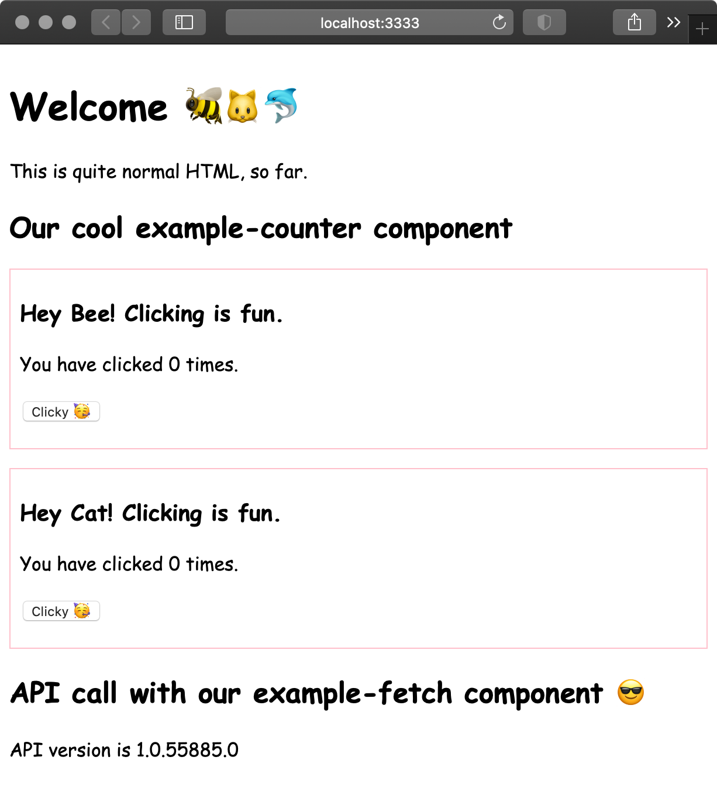

# Examples from workshop introducing modern frontend

* In the [example-web-component](./example-web-component) directory: we manually create a new Custom Element to see how the standard works.
* In the [example-stencil-app](./example-stencil-app) directory: we see how components are built using Stencil. Check out the readme in there for details.

